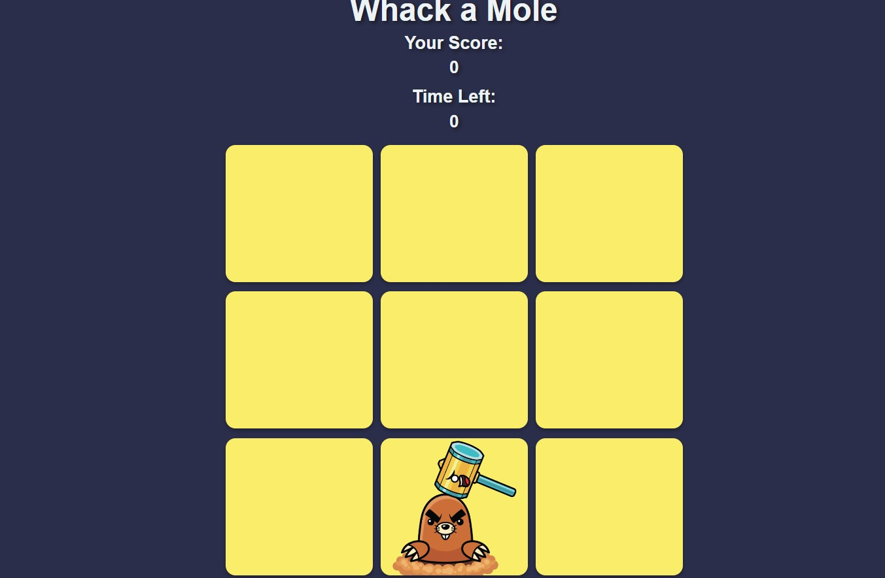

# Whack-a-Mole Game

A simple Whack-a-Mole game implemented using HTML, CSS, and JavaScript.

[Live site](https://aneal07.github.io/Whack-a-Mole/)

## Game Description

In this game, moles will randomly pop up from the holes on the grid, and your goal is to click on them to whack them. Each time you successfully hit a mole, your score will increase. The game lasts for 60 seconds, and your final score will be displayed at the end.

## Features

- Random appearance of moles on the grid.
- Score tracking.
- Countdown timer.
- Game over message with final score.

## How to Play

1. Open the [Whack-a-Mole Game](https://aneal07.github.io/Whack-a-Mole/index.html) in your web browser.
2. Click on the moles as they appear to whack them.
3. Your score will increase for each successful hit.
4. Try to achieve the highest score within the given time limit.

## Demo

You can play the game online by visiting the following link: [Whack-a-Mole Game](https://aneal07.github.io/Whack-a-Mole/index.html)

## Technologies Used

- HTML
- CSS
- JavaScript

## Screenshot

## License

This project is licensed under the [MIT License](LICENSE).
